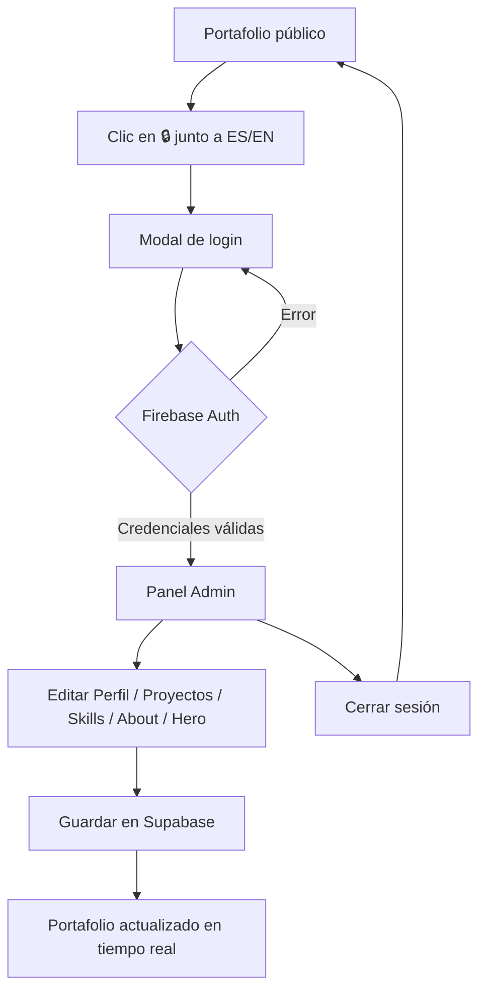

# 🧑‍💻 Portafolio | Jhorman Castellanos


## 🌐 Web en vivo

<div align="center">
  <a href="https://jhormancastella.github.io/portafolio/" target="_blank">
    
  </a>
</div>

---

## 📖 Descripción

Portafolio personal de **Jhorman Jesus Castellanos Morales** — Desarrollador Web Junior, Fotógrafo y Técnico en Sistemas. Construido en vanilla JS con contenido dinámico gestionado desde **Supabase** y un panel de administración protegido con **Firebase Auth**, todo sin frameworks ni dependencias de build.

---

## ✨ Características principales

- **Efecto Matrix** – Fondo animado con Canvas API, adaptado al tema claro/oscuro.
- **Modo oscuro/claro** – Cambio de tema con persistencia en localStorage.
- **Bilingüe ES/EN** – Todo el contenido alterna entre español e inglés con un clic.
- **Carrusel 3D de habilidades** – Animación CSS 3D con rotación automática.
- **Carrusel hero automático** – Imágenes que rotan con transición suave.
- **Panel Admin** – Edita todo el portafolio sin tocar código, protegido con Firebase Auth.
- **Contenido dinámico** – Proyectos, habilidades, perfil y textos cargados desde Supabase.
- **Responsive** – Optimizado desde 360px hasta pantallas 1400px+.
- **Formulario de contacto** – Integrado con FormSubmit.

---

## 🧭 Flujo del modo Admin



---

## 🛠️ Tecnologías utilizadas

| Capa | Tecnología |
|------|-----------|
| Frontend | HTML5, CSS3, JavaScript vanilla |
| Base de datos | Supabase (PostgreSQL + RLS) |
| Autenticación | Firebase Auth (Email/Password) |
| Efectos | Canvas API (Matrix), CSS 3D transforms |
| Fuentes/íconos | Google Fonts (Inter), Font Awesome 6 |
| Formulario | FormSubmit |
| Hosting | GitHub Pages |

---

## 📂 Estructura del proyecto

```
portfolio/
├── index.html              # Portafolio público
├── admin.html              # Panel de administración
├── css/
│   └── styles.css          # Estilos globales y responsive
└── js/
    ├── config.js           # Keys de Firebase y Supabase
    ├── main.js             # Lógica pública (lee de Supabase)
    └── admin.js            # CRUD Supabase + Firebase Auth
```

---

## 🚀 Uso local

### 1. Clonar el repositorio

```bash
git clone https://github.com/Jhormancastella/portafolio.git
cd portafolio
```

### 2. Configurar servicios

**Supabase** — crea un proyecto, configura las tablas necesarias y obtén tu `Project URL` y `anon key`.

**Firebase** — crea un proyecto, habilita Authentication → Email/Password y agrega tu usuario admin.

Edita `js/config.js` con tus propias keys.

### 3. Abrir el proyecto

Abre `index.html` directamente en el navegador o usa un servidor local:

```bash
npx serve .
```

⚠️ No requiere backend ni instalación de dependencias.

---

## 🔐 Seguridad

- La `anon key` de Supabase es pública por diseño — solo permite lo que las políticas RLS autorizan.
- La escritura en Supabase está protegida por Firebase Auth en el frontend.
- La `service_role key` de Supabase **nunca** se usa en el frontend.
- El panel admin solo es accesible con credenciales válidas de Firebase.

---

## 🔍 SEO

- Metatags Open Graph y Twitter Card configurados.
- `robots` meta tag con `index, follow`.
- Estructura semántica HTML5 (`header`, `main`, `section`, `article`, `footer`).

---

## 📄 Licencia

Este proyecto se distribuye bajo la licencia MIT. Consulta el archivo LICENSE para más detalles.

---

## 📬 Contacto

- 📧 Email: [jesusjhorman@gmail.com](mailto:jesusjhorman@gmail.com)
- 💼 LinkedIn: [Jhorman Castellanos](https://www.linkedin.com/in/jhorman-jesus-castellanos-morales-245b97261)
- 🐱 GitHub: [Jhormancastella](https://github.com/Jhormancastella)

---

© 2026 Jhorman Jesus Castellanos Morales – Hecho con ❤️ para mostrar mi trabajo al mundo.
